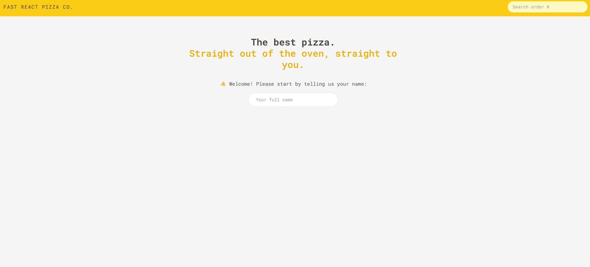
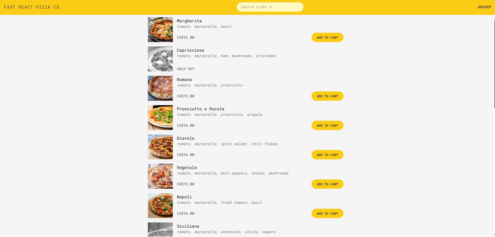
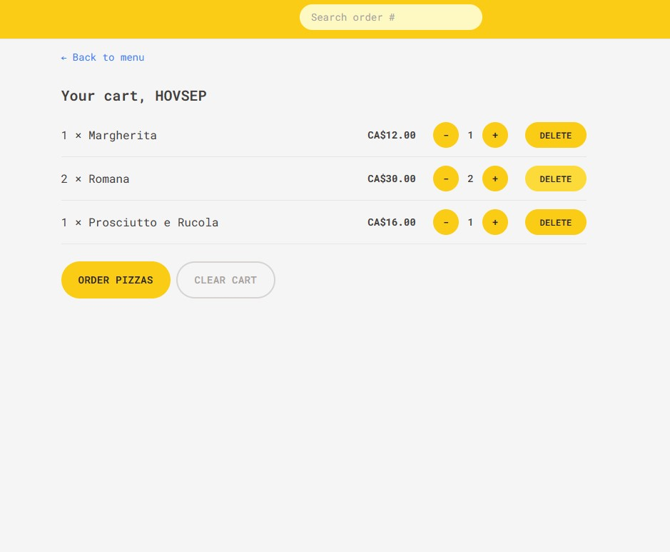
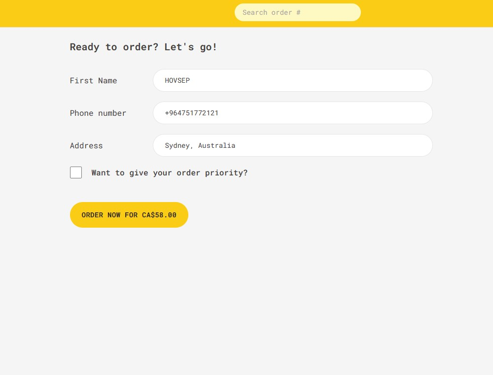
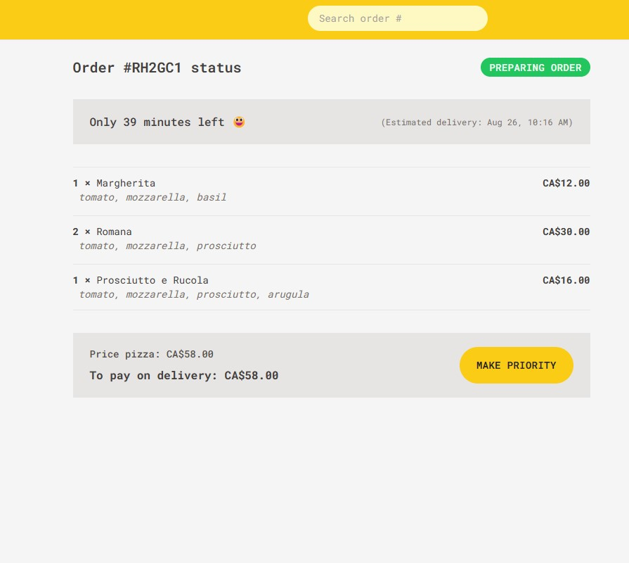

# Fast React Pizza

A React application that lets users browse a pizza menu and place orders.

## Features

- users can order one or more pizzas from a menu
- does not require login; users input their name before placing an order
- menu is loaded from an API
- users can add pizzas to a cart and change quantity
- user's address is pre-filled based on their GPS location
- users can mark their order as a priority order
- users can update their order to make it a priority order
- each order has a unique ID that can be used to search an order and see order details later

## Technologies used

- React
- React Router
- Redux Toolkit
- TypeScript
- TailwindCSS
- Vite

## Screenshots











## Run Locally

Clone the project

```bash
  git clone https://link-to-project
```

Go to the project directory

```bash
  cd my-project
```

Install dependencies

```bash
  npm install
```

Start the server

```bash
  npm start
```

## Acknowledgements

This my finished Fast React Pizza App ✈️ PART- 4 based on A Ultimate React Course by Jonas Schmedtmann
As the description suggests, the original design was done by Jonas Schmedtmann and was part of a Ultimate React Course which I highly recommend. https://www.udemy.com/course/the-ultimate-react-course/

## License

[MIT](https://choosealicense.com/licenses/mit/)
